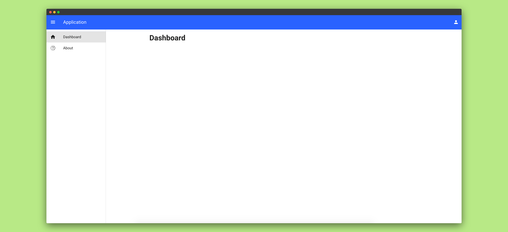

# VueJS Boilerplate Template
A pre-baked template that uses:
* Router https://router.vuejs.org/
* Vuex https://vuex.vuejs.org/
* Vuetify Components https://vuetifyjs.com/en/
* MDI Icons https://materialdesignicons.com/ follow the instructions on Vuetify on how to use them.



## Requirements
The below items are not necessary but will help with further development.
### Yarn
> Yarn is a package manager for your code. It allows you to use and share (e.g. JavaScript) code with other developers from around the world. Yarn does this quickly, securely, and reliably so you don’t ever have to worry.

Installation guide https://classic.yarnpkg.com/en/docs/install/

### Git
> Git is a free and open source distributed version control system designed to handle everything from small to very large projects with speed and efficiency. 

Installation guide https://git-scm.com/

### VueJS CLI
> Vue CLI aims to be the standard tooling baseline for the Vue ecosystem. It ensures the various build tools work smoothly together with sensible defaults so you can focus on writing your app instead of spending days wrangling with configurations. At the same time, it still offers the flexibility to tweak the config of each tool without the need for ejectin

Installation guide https://cli.vuejs.org/guide/installation.html
## Project setup
Clone the repository
```bash
~$ git clone https://github.com/arivictor/vuejs-project-boilerplate-template.git
```
Change directory
```bash
~$ cd directory vuejs-project-boilerplate-template
```
Install project dependencies
```
~$ yarn install
```

## Development
Compiles and hot-reloads for development/testing locally
```
~$ yarn serve
```

### Compiles and minifies for production
```
~$ yarn build
```

### Lints and fixes files
```
~$ yarn lint
```

### Customize configuration
See [Configuration Reference](https://cli.vuejs.org/config/).
